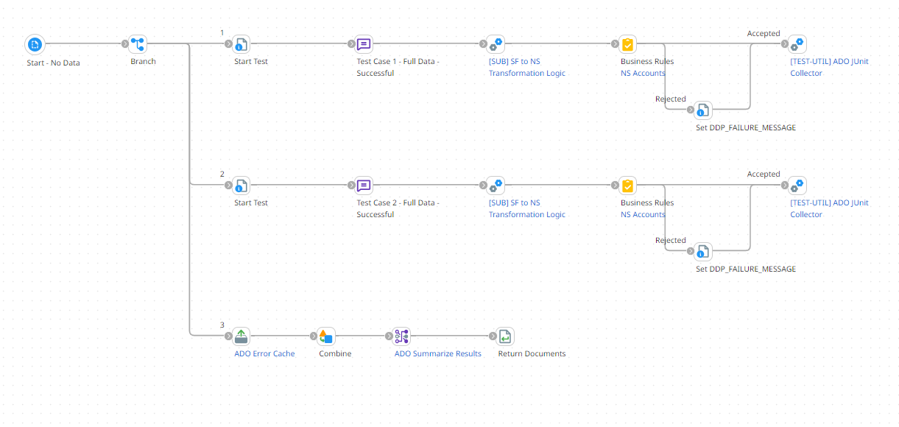
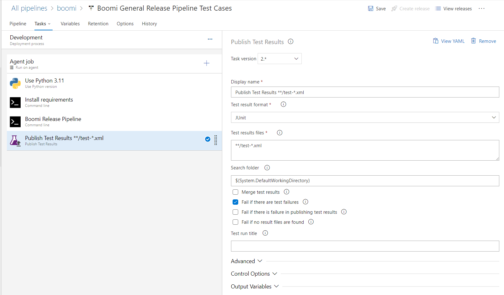
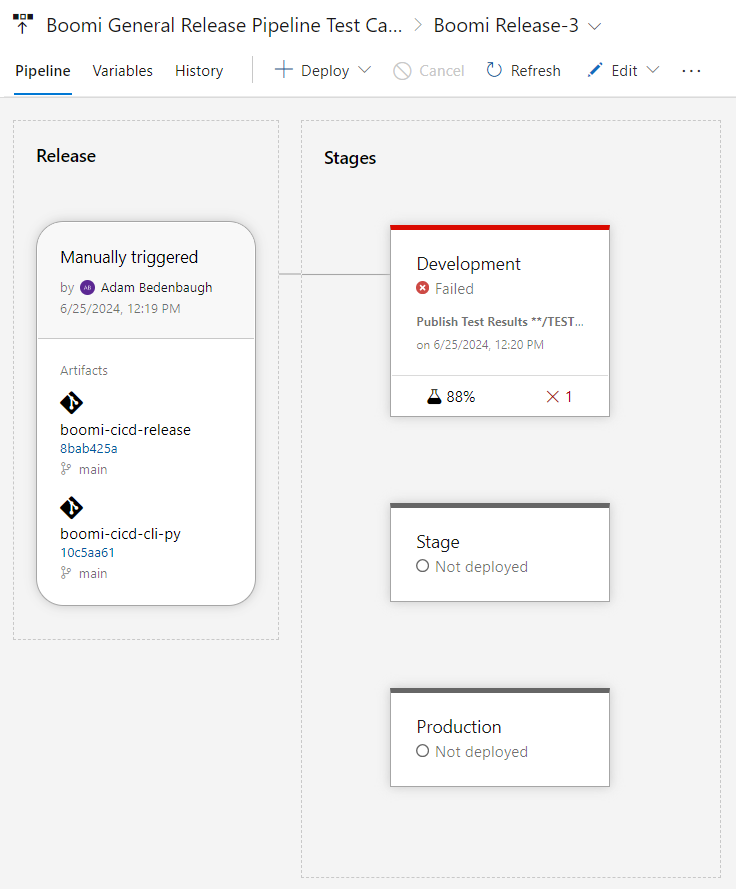

.. _automated_testing:

Automated Testing
============================

The ``automated_testing.py`` script is an example script on how to create a pipeline that can perform automated unit testing on processes. The main process should be designed with testing in mind and with testable subprocesses. A testing harness, which is a second process that contains the subprocess from the main deployable process, will be used to perform unit tests on the subprocesses. The testing harness process will contain multiple tests, each test will send data into the subprocess by a message shape and any required properties, and then the data flowing out of the subprocess will be evaluated against expected results. If it does not pass, an exception will be thrown and the execution will stop.

The following figure is an example main process that is configured to be deployed and used within production. The [SUB] Salesforce Query will contain a Salesforce query. The [SUB] NetSuite Account Create subprocess will contain a NetSuite create operation. Both of these will not be tested. Within the middle, the [SUB] SF to NS Transformation Logic will be tested.

.. figure:: assets-automated-testing/main-deployable-process.png
   :width: 80%
   :align: center

   Figure 1. Example main process that is designed to be deployed to production.

Figure 2 is an example of a Testing Harness process. It contains multiple tests against the [SUB] SF to NS Transformation Logic subprocess. Each branch performs a different test. Each branch starts with a message shape that contains input data. If dynamic document properties or dynamic process properties were required, they can also be set at this point. After the data passes through the subprocess that is being tested, the output is validated. If the output data does not pass the validation tests, which is a decision shape in this example, then an exception is thrown. Boomi developers can easily run this process within the build tab. However, it can additionally be run and tested within a release pipeline. The script below shows an execution of the testing harness within a lower environment and will raise an exception if any tests fail.

.. figure:: assets-automated-testing/test-harness-process.png
   :width: 80%
   :align: center

   Figure 2. Example test harness used for unit testing.

The script below is an example that can be used to execute the test harness process and if successful, deploy to the Development environment.

.. literalinclude:: ../../boomi_cicd/scripts/automated_testing.py
   :language: python
   :linenos:

Release JSON File
-----------------

The first pipeline object contains an element called automatedTestId which is a component ID of the test process harness. It will also be deployed in a lower environment, executed, and the execution status checked.

.. literalinclude:: ../../boomi_cicd/templates/release.json
   :language: json
   :linenos:

Required Environment Variables
------------------------------
.. table:: Required Environment Variables
   :width: 100%
   :align: left

   +-----------------------+-----------------------------------------------------------------------------+
   | Environment Variable  | Description                                                                 |
   +=======================+=============================================================================+
   | BOOMI_ACCOUNT_ID      | The Boomi account ID.                                                       |
   +-----------------------+-----------------------------------------------------------------------------+
   | BOOMI_ATOM_NAME       | The name of the Boomi Atom.                                                 |
   +-----------------------+-----------------------------------------------------------------------------+
   | BOOMI_BASE_URL        | The base URL for the Boomi API. https://api.boomi.com/api/rest/v1           |
   +-----------------------+-----------------------------------------------------------------------------+
   | BOOMI_ENVIRONMENT_NAME| The Boomi environment name.                                                 |
   +-----------------------+-----------------------------------------------------------------------------+
   | BOOMI_PASSWORD        | The Boomi password. Atomsphere API Token is recommended                     |
   +-----------------------+-----------------------------------------------------------------------------+
   | BOOMI_RELEASE_FILE    | The name of the release JSON file to use.                                   |
   +-----------------------+-----------------------------------------------------------------------------+
   | BOOMI_USERNAME        | The Boomi username. Atomsphere API Token is recommended                     |
   +-----------------------+-----------------------------------------------------------------------------+

Alternative Testing Strategies Using JUnit XML Format
---------------------------------------------------------

The concepts within this section build upon the previous section but demonstrate an additional way to implement automated unit testing. After the initial test harness is built out, the assertion steps after validation can be formatted to a JUnit XML file and
configured to be viewed at a return document shape.  The JUnit XML format is important because it is common for CICD tools to
automatically parse this format and display the results in a more user-friendly way. Below is an example JUnit XML
that has two test cases and the second test case failed. The JUnit XML schema can be found
at `JUnit XML Schema <https://github.com/windyroad/JUnit-Schema/blob/master/JUnit.xsd>`_.

.. code-block::
   :caption: Example JUnit XML format

    <?xml version='1.0' encoding='UTF-8'?>
    <testsuites>
      <testsuite name="[TEST] Salesforce to NetSuite Account ADO" tests="3" time="3275">
        <testcase name="Test Case 1 - Value is set to 1" time="2241" />
        <testcase name="Test Case 2 - Value is set to 2" time="432" />
          <failure message="Data did not match expected results." />
        </testcase>
      </testsuite>
    </testsuites>

The figure below has two tests that are being executed. The results of each test are put into a Document Cache.
The final branch retrieved all documents from the cache and combines the documents into a single document. The fully combined
document will be available in the Return Document shape within Process Reporting.

   Figure 3. Example test harness used for unit testing with JUnit XML format.

The script below is an example script that can be used to execute the test harness process, retrieve the automatically
JUnit XML document at the return document shape, and write the JUnit XML to a file. Update the script to fit any specific requirements.

.. literalinclude:: ../../boomi_cicd/scripts/automated_testing_junit.py
   :language: python
   :linenos:

The following is an example configuration of how Azure DevOps can be configured to read the JUnit XML file within
a Release Pipeline. If any test fails, the release pipeline will fail. The percentage of tests that passed can be viewed within the pipeline.

   Figure 4. Example JUnit Test Results in Azure DevOps.

The image below is from an Azure DevOps Release Pipeline and shows that 88% of the tests passed within the release pipeline. Additional details can be seen by clicking on the test results section of the stage.

   Figure 4. Example JUnit Test Results in Azure DevOps.

Additional Resources
-------------------------------

* `Boomi Community: Boomi Harness <https://community.boomi.com/s/article/Test-Harness>`_
* `Boomi Community: Testing Strategies <https://community.boomi.com/s/article/testingstrategies>`_
