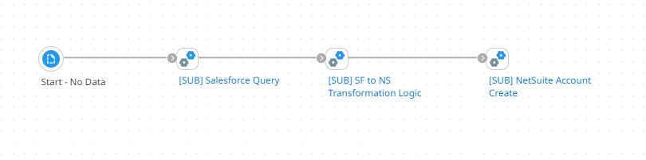
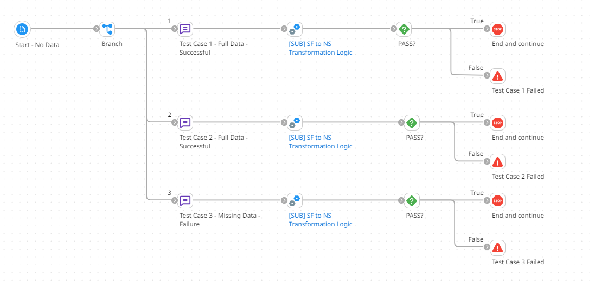

.. _automated_testing:

Automated Testing
============================

The ``automated_testing.py`` script is an example script in how to create a pipeline that can perform automated unit testing on processes. The main process should be designed with testing in mind and with testable subprocesses. A testing harness, which is a second process that contains the subprocess from the main deployable process, will be used to perform unit tests on the subprocesses. The testing harness process will contain multiple tests, each test will send data into the subprocess by a message shape and any required properties, then the data flowing out of the subprocess will be evaulated to pass the test or not. If it does not pass, an exception will be thrown and the execution will stop.

The following figure is an example main process that is configured to be deployed and used within production. The [SUB] Salesforce Query will contain a Salesforce query. The [SUB] NetSuite Account Create subprocess will contain a NetSuite create operation. Both of these will not be tested. Within the middle, the [SUB] SF to NS Transformation Logic will be tested.

   Figure 1. Example main process that is designed to be deployed to production.

Figure 2 is an example of a Testing Harness process. It contains multiple tests against the [SUB] SF to NS Transformation Logic subprocess. Each branch performs a different test. Each branch starts with a message shape that contains input data. If dynamic document properties or dynamic process properties were required, they can also be set at this point. After the data passes through the subprocess that is being tested, the output is validated. If the output data does not pass the validation tests, which is a decision shape in this example, then an exception is thrown. Boomi developers can easily run this process within the build tab. Although, it can additionally be ran and tested within a release pipeline. The script below shows an execution of the testing harness within a lower environment, and will raise an exception if any tests fail.

   Figure 2. Example test harness used for unit testing.

The script below is an example script that can be used to execute the test harness process and if successful, deploy to the Development environment.

.. literalinclude:: ../../boomi_cicd/scripts/automated_testing.py
   :language: python
   :linenos:

Release JSON File
-----------------

The first pipeline object contains an element called automatedTestId that is a component id of the test process harness. It will also be deployed in a lower environment, executed, and the execution status checked.

.. literalinclude:: ../../boomi_cicd/templates/release.json
   :language: json
   :linenos:

Required Environment Variables
------------------------------
.. table:: Required Environment Variables
   :width: 100%
   :align: left

   +-----------------------+-----------------------------------------------------------------------------+
   | Environment Variable  | Description                                                                 |
   +=======================+=============================================================================+
   | BOOMI_ACCOUNT_ID      | The Boomi account ID.                                                       |
   +-----------------------+-----------------------------------------------------------------------------+
   | BOOMI_ATOM_NAME       | The name of the Boomi Atom.                                                 |
   +-----------------------+-----------------------------------------------------------------------------+
   | BOOMI_BASE_URL        | The base URL for the Boomi API. https://api.boomi.com/api/rest/v1           |
   +-----------------------+-----------------------------------------------------------------------------+
   | BOOMI_ENVIRONMENT_NAME| The Boomi environment name.                                                 |
   +-----------------------+-----------------------------------------------------------------------------+
   | BOOMI_PASSWORD        | The Boomi password. Atomsphere API Token is recommended                     |
   +-----------------------+-----------------------------------------------------------------------------+
   | BOOMI_RELEASE_FILE    | The name of the release JSON file to use.                                   |
   +-----------------------+-----------------------------------------------------------------------------+
   | BOOMI_USERNAME        | The Boomi username. Atomsphere API Token is recommended                     |
   +-----------------------+-----------------------------------------------------------------------------+

Additional Resources
-------------------------------

* `Boomi Community: Boomi Harness <https://community.boomi.com/s/article/Test-Harness>`_
* `Boomi Community: Testing Strategies <https://community.boomi.com/s/article/testingstrategies>`_
