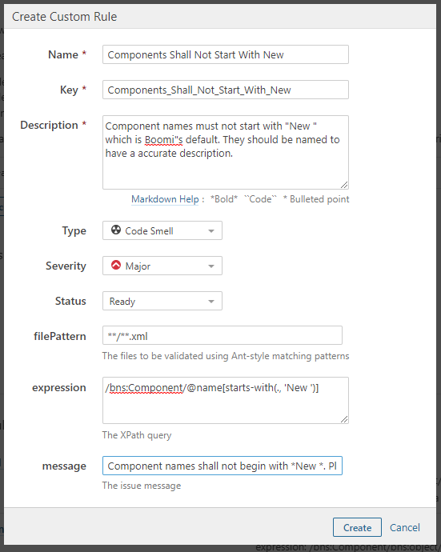
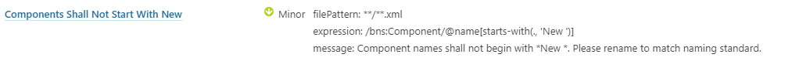
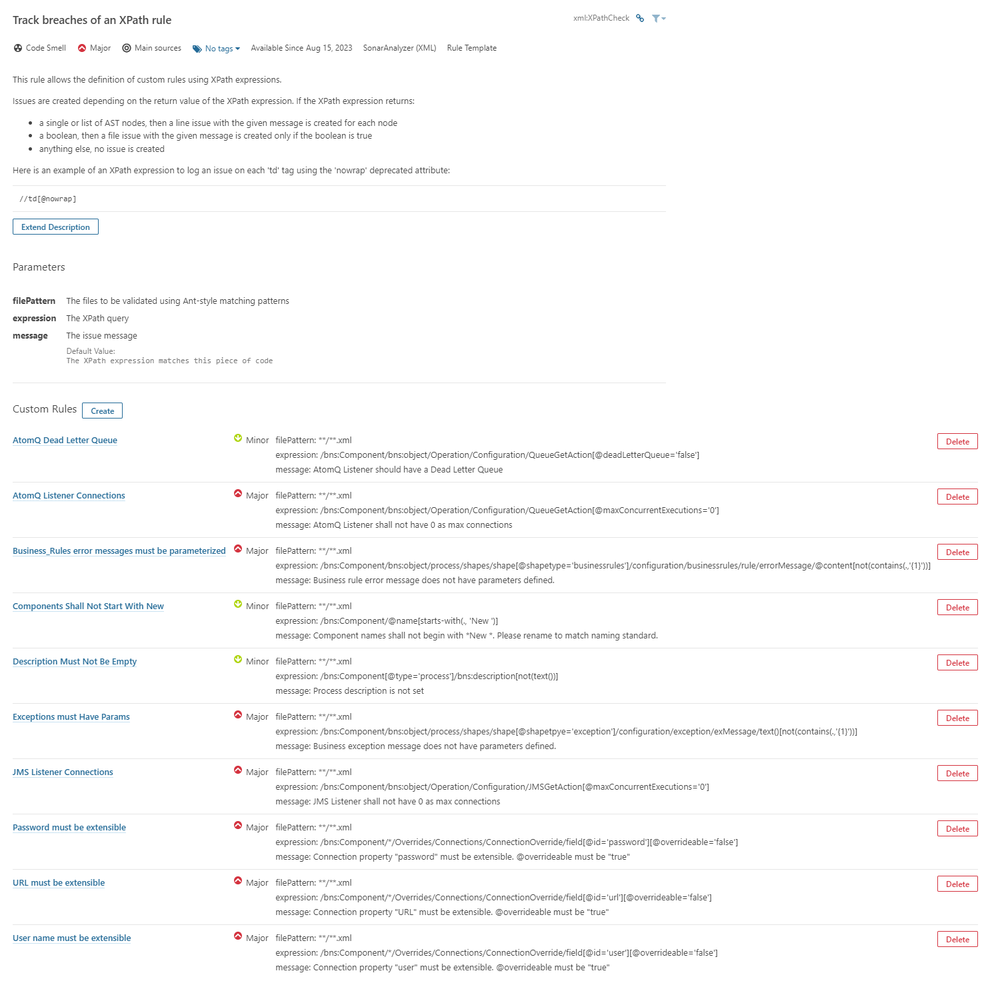
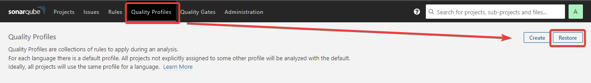
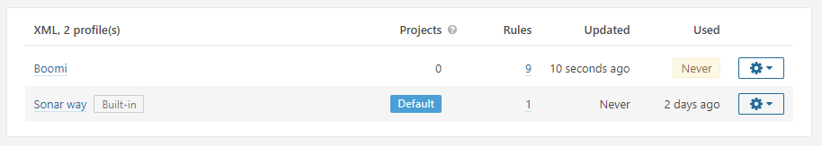
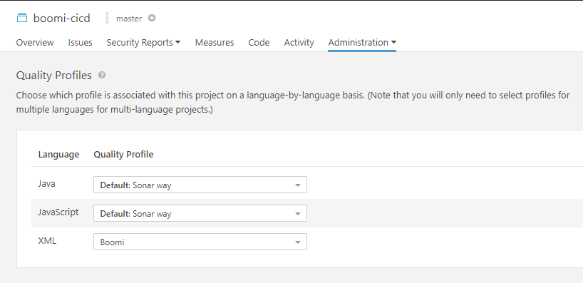
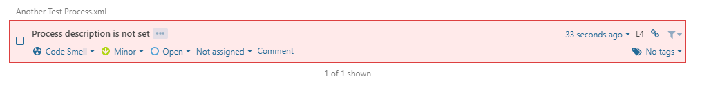
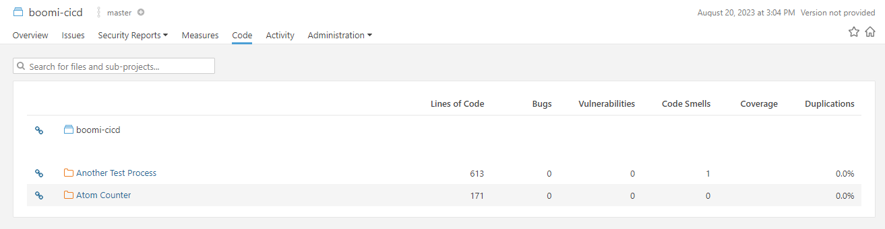

Component XML Repository Scripts
================================

There are three example scripts for adding the component XML to a repository and performing code quality analysis on the integrations. The three are independent of each other but can also be used together to perform required tasks.

1. ``component_xml_git.py`` - This script will add the component XML from the release file to a repository. The script will loop through the processes that are being deployed and add all component XMLs that are associated with a packaged component into a directory in the repository.
2. ``component_xml_code_quality.py`` - This script will perform a code quality check based on the rules found within `boomi_cicd/templates/sonarqube/BoomiSonarRules.xml <https://bitbucket.org/officialboomi/boomi-cicd-cli-py/src/main/boomi_cicd/templates/sonarqube/BoomiSonarRules.xml>`_. Once the code quality analytsis is complete, the results are commited to the Boomi Components XML repository. component_xml_git.py is required to be run before this script.
3. ``component_xml_sonarqube.py`` - This script will perform a code quality check within SonarQube. component_xml_git.py is required to be run before this script. Once the component_xml_git.py is ran, this script will load the XML files into SonarQube to perform a code analysis.


component_xml_git.py
--------------------

The ``component_xml_git.py`` script will loop through the packaged components that are being deployed and add all component XMLs that are associated with the packaged component into a folder in the repository. The folder structure is as follows:

.. code-block:: text

   boomi_components/<package_component_name>/<component_name>.xml


.. table:: Table 1. Required Environment Variables for `component_xml_git.py`
   :align: center

   +--------------------------------+--------------------------------------------------------------------------------+
   | Environment Variable           | Values                                                                         |
   +================================+================================================================================+
   | BOOMI_COMPONENT_GIT_URL        | URL for the Boomi Components Repo. The URL includes a private access token.    |
   +--------------------------------+--------------------------------------------------------------------------------+
   | BOOMI_COMPONENT_REPO_NAME      | The name of the repo directory created during the                              |
   |                                | build. Boomi_Components is the default. Optional.                              |
   +--------------------------------+--------------------------------------------------------------------------------+
   | BOOMI_RELEASE_FILE             | Release file that contains components to deploy.                               |
   +--------------------------------+--------------------------------------------------------------------------------+


component_xml_code_quality.py
-----------------------------

The ``component_xml_code_quallity.py`` script will take the XMLs from the Boomi_Components repository and run a code quality check on them. The check uses rules found within boomi_cicd/templates/sonarqube/BoomiSonarRules.xml. The XML structure of the BoomiSonarRules are based on the backup profile within SonarQube. Other files can be used by defining the ``BOOMI_SONAR_RULES_FILE`` environment variable.

Once the check is complete, the results are written to the boomi_components repo and commited to the main repo. The results of the code qualilty check is written to ``report.md`` within the root directory of the repository and is formatted in markdown.


.. table:: Table 2. Required Environment Variables for `component_xml_code_quality.py`
   :align: center

   +--------------------------------+--------------------------------------------------------------------------------+
   | Environment Variable           | Values                                                                         |
   +================================+================================================================================+
   | BOOMI_COMPONENT_REPO_NAME      | The name of the repo directory created during the                              |
   |                                | build. Boomi_Components is the default. Optional.                              |
   +--------------------------------+--------------------------------------------------------------------------------+
   | BOOMI_SONAR_RULES_FILE         | The file that contains the code quality rules. The file is                     |
   |                                | ```boomi_cicd/templates/sonarqube/BoomiSonarRules.xml``                        |
   +--------------------------------+--------------------------------------------------------------------------------+


component_xml_sonarqube.py
--------------------------

SonarQube is a tool used to perform code quality checks. It is often used with code. For Boomi, the XPath feature within SonarQube will be used to perform code quality checks on the Boomi Component XML. `XPath <https://developer.mozilla.org/en-US/docs/Web/XPath>`_ is a query language for selecting nodes from an XML document.

First create a new Project and a token for the project. The project can be created under Administration -> Project -> Management. The token can be created for a user by going to My Account -> Security -> Tokens. The token will be used in the script to authenticate with SonarQube.

Once the project has been created, the XPath rules need to be added to SonarQube. To add rules to SonarQube go to Rules and Search for `Track breaches of an XPath rule`. Click on it and then click on "Create". Add the information that is found within the ``boomi_cicd/templates/sonarqube/BoomiSonarRules.xml`` file. Each rule will need to be added manually to SonarQube.



   Figure 1. Create new rule in SonarQube.


Once complete, the rule will show up under Customer Rules within `Track breaches of an XPath rule`.



   Figure 2. New rule that has beeen created in SonarQube.


Figure 3 shows what SonarQube looks like once all Boomi SonarQube rules have been added to the custom XPath rules.



   Figure 3. Boomi Rules in SonarQube


Once the rules have been added, the Quality Profile backup can be restored. Go to Quality Profiles and click on Restore. Select a locally downloaded version of ``BoomiSonarRules.xml`` file and click on Restore. This will add all the newly created rules to the profile. The file does not create rules, but it does add existing rules to the profile.



   Figure 4. Restore Quality Profile in SonarQube




   Figure 5. The Boomi Profile will be visable after the Quality Profile has been restored.


The new Quality Profile will need to be added to the new project. Go to Project -> new project -> Administration -> Quality Profiles. Next to XML, select Boomi as the Quality Profile. This will add the Boomi rules to the project.




   Figure 6. The Boomi Profile added to the Project.


Finally, the following is the example python script for executing SonarQube. The script will download SonarScanner, which is a tool used to send the code (Component XML from the ``component_xml_git.py`` script) to SonarQube for analysis. Once complete, the analystic can be seen in SonarQube.


.. literalinclude:: ../../boomi_cicd/scripts/component_xml_sonarqube.py
   :language: python
   :linenos:


To run the script above, the following environment variables need to be set. The table below shows the required environment variables.

.. table:: Table 3. Required Environment Variables for SonarQube
   :align: center

   +--------------------------------+------------------------------------------------------+
   | Environment Variable           | Values                                               |
   +================================+======================================================+
   | BOOMI_SONARQUBE_HOST_URL       | URL for Sonarqube. i.e. https://domain.com:9000      |
   +--------------------------------+------------------------------------------------------+
   | BOOMI_SONARQUBE_PROJECT_KEY    | The key for the newly created project                |
   +--------------------------------+------------------------------------------------------+
   | BOOMI_SONARQUBE_TOKEN          | The user token                                       |
   +--------------------------------+------------------------------------------------------+


When the SonarQube script runs, if there are any XMLs that have bugs, then an error notification will be shown.



   Figure 7. SonarQube Bug Notification


Each process will be a folder under Project -> Code. The folder will be named after the process. The folder will contain the Component XML.



   Figure 8. SonarQube Bug Notification