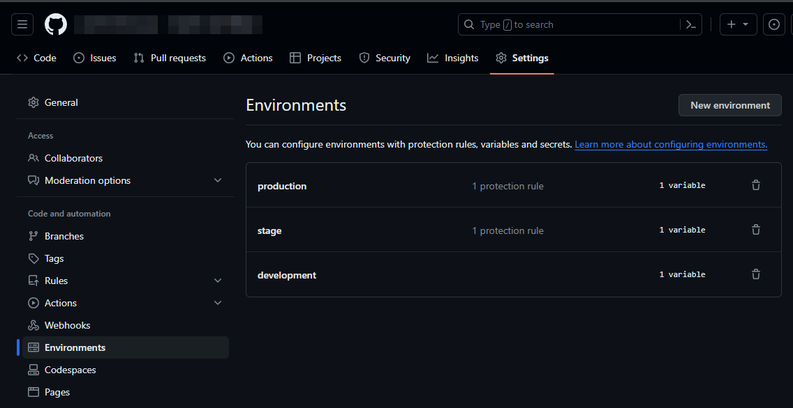
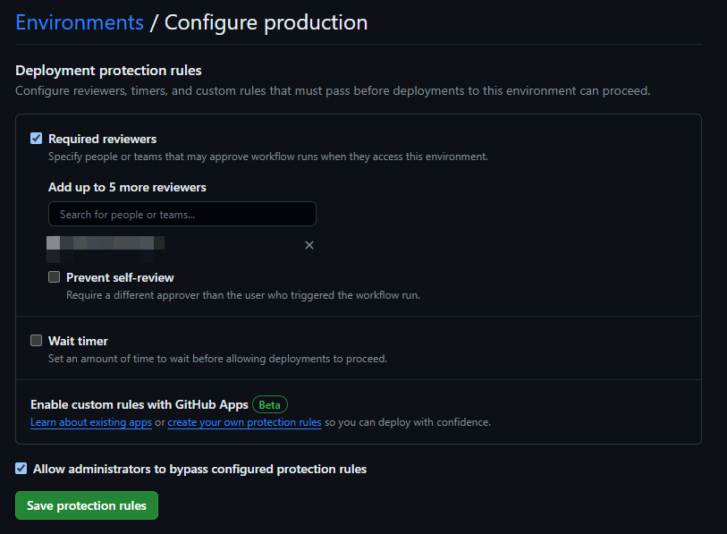
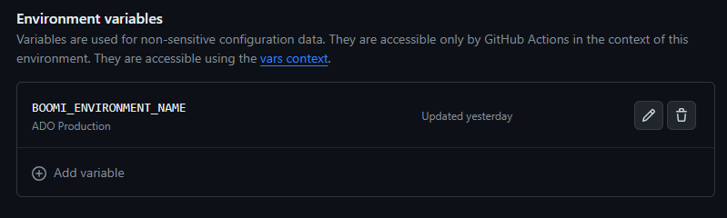
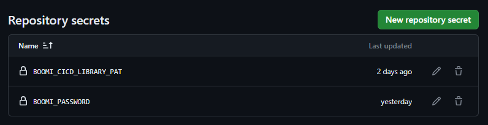
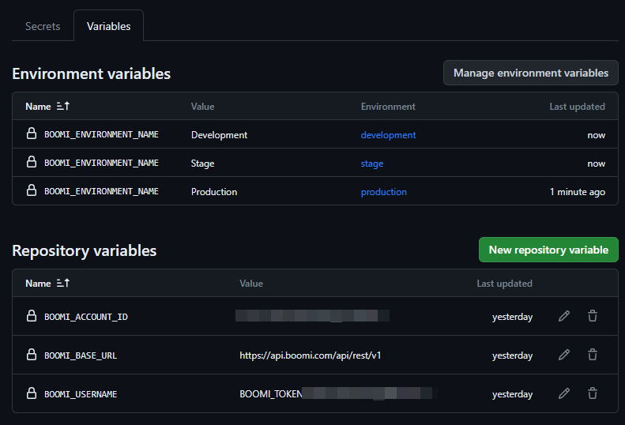
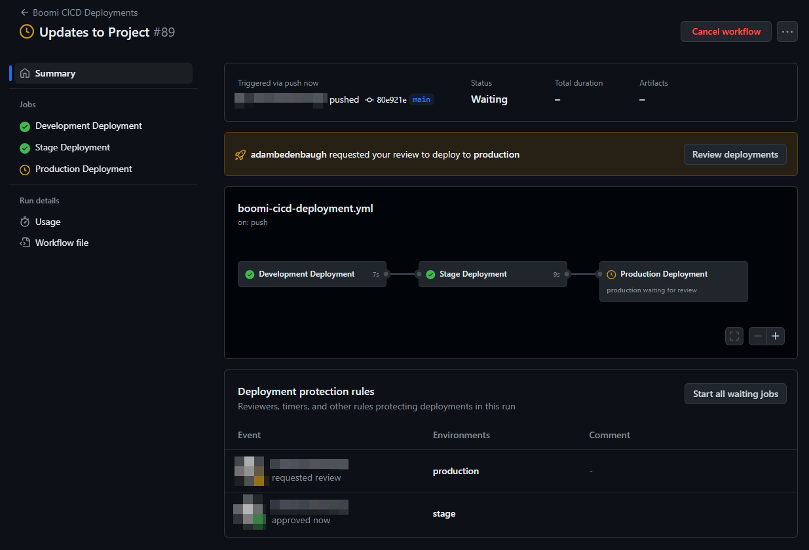

GitHub Actions
====================

This guide provides instructions on how to set up GitHub Actions for Boomi CICD. The guide will assume that there is an existing Booomi CICD Library that is used amount multiple projects and an multiple repo for individual projects. The individual projects will be using the Boomi CICD Library to deploy the Boomi processes through GitHub Actions whenever a push is made to the main branch.

1 Access Boomi CICD Library
--------------------------------------------------------

First create a `fine-grained Private Access Token (PAT) <https://docs.github.com/en/authentication/keeping-your-account-and-data-secure/managing-your-personal-access-tokens#creating-a-fine-grained-personal-access-token>`_  to access the boomi-cicd-cli-py library. The PAT will be used to authenticate the GitHub Actions workflow to access the Boomi CICD Library. Go into the boomi-cicd-cli-py repo that was cloned to GitHub. Click on your user icon -> Settings. Then click on Developer Settings -> Personal Access Token -> Fine-grained tokens. Under Repository access, select Only select repositories, and select the boomi-cicd-cli-py repository. Then select the following permissions. Save and use the PAT in step 4.1 - Add Repository Secrets.

.. table:: Table 2. Private Access Token Permissions.
   :align: center

   +------------------------+------------------------------------------------------+
   | Permission             | Access                                               |
   +========================+======================================================+
   | Contents               | Access: Read-only                                    |
   +------------------------+------------------------------------------------------+
   | Metadata               | Access: Read-only                                    |
   +------------------------+------------------------------------------------------+

2 Add a GitHub Actions Workflow
---------------------------------------

Within the repository, create a new YAML file in the .github/workflows directory. This file will contain the GitHub Actions workflow that will be used to deploy the Boomi integrations. Below is an example repo directory structure that is used within the GitHub Actions template.

The GitHub Actions template is found within `boomi-cicd-cli-py/boomi_cicd/templates/github_actions`. Update the `<company-organization>` within the Checkout Boomi CICD Library step within the GitHub actions workflow to the name of your organization.

::

   boomi-cicd-release/
   ├──.github/
   │   └──workflows/
   │      └── boomi-cicd-deployments.yml
   ├──boomi_release/
   │  └── release.json

3 Set up Environments
---------------------------------------

The example GitHub Actions template will use three Boomi environments: Development, Stage, and Production. When a push is made to the main branch, the process will automatically be deployed to the Development environment. Manually authorization will be needed to deploy to the Stage and Production environments.

3.1 Create a New Environment
-----------------------------------------

Navigate to Settings -> Environments -> New Environment. Add an environment for each Boomi environment.

   Figure 1. Create GitHub Environments

3.2 Add Protection Rules
-----------------------------------------

Once the environment have been made, Protection Rules can be added to the Stage and Production environment. This will require manual authorization to deploy to these environments. Click on the environment and select Required reviered. Select the desired approvers.

   Figure 2. Enable Deployment Protection Rules

3.3 Add Environment Variables
-------------------------------------------

The Environment Variables will need to be added to each environment. Each environment will have the `BOOMI_ENVIORNMENT_NAME` variable set as the name of the Boomi environment. This will be used to deploy the Boomi processes to the correct environment. Go in to each environment, select Add Environment variables, add the `BOOMI_ENVIRONMENT_NAME` variable, and set the value to the name of the Boomi environment. The BOOMI_ATOM_NAME variable is used to set scheduels on a specific atom. This is optional and can be added if needed.

.. table:: Table 2. Required Environment Variables
   :align: center

   +------------------------+------------------------------------------------------+
   | Environment Variable   | Values                                               |
   +========================+======================================================+
   | BOOMI_ATOM_NAME        | <name-of-atom-to-set-schedules-on> (optional)        |
   +------------------------+------------------------------------------------------+
   | BOOMI_ENVIRONMENT_NAME | <name-of-boomi-environment>                          |
   +------------------------+------------------------------------------------------+

   Figure 3. Set Environment Variables

4 Set up Variables and Secrets
--------------------------------------------

4.1 Add Repository Secrets
--------------------------------------------

Select Settings > Secrets and Variables > Actions > New Repository Secret. Add the following secrets to the repository.

.. table:: Table 3. Required Environment Variables
   :align: center

   +------------------------+------------------------------------------------------+
   | Repository Variable    | Values                                               |
   +========================+======================================================+
   | BOOMI_CICD_LIBRARY_PAT | <token-created-during-step-2>                        |
   +------------------------+------------------------------------------------------+
   | BOOMI_PASSWORD         | <boomi-api-token>                                    |
   +------------------------+------------------------------------------------------+

   Figure 4. Add Repository Secrets.

4.2 Add Repository Variables
---------------------------------------------

Next, add the following repository variables to the repository. These variables will be used to authenticate the Boomi CICD Library.

.. table:: Table 4. Required Environment Variables
   :align: center

   +------------------------+------------------------------------------------------+
   | Repository Variable    | Values                                               |
   +========================+======================================================+
   | BOOMI_ACCOUNT_ID       | <boomi-account-id>                                   |
   +------------------------+------------------------------------------------------+
   | BOOMI_BASE_URL         | https://api.boomi.com/api/rest/v1                    |
   +------------------------+------------------------------------------------------+
   | BOOMI_USERNAME         | BOOMI_TOKEN.<username>                               |
   +------------------------+------------------------------------------------------+

   Figure 5. Enable Deployment Protection Rules

5 Run GitHub Actions
-------------------------------------------

Once complete, the GitHub Action will automatically run when a commit is pushed to main. The figure below shows an example GitHub Actions Workflow that has been successfully deployed to Development, approved for Stage, and waiting for approval in Production.

   Figure 6. Enable Deployment Protection Rules

