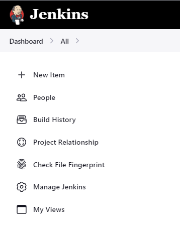
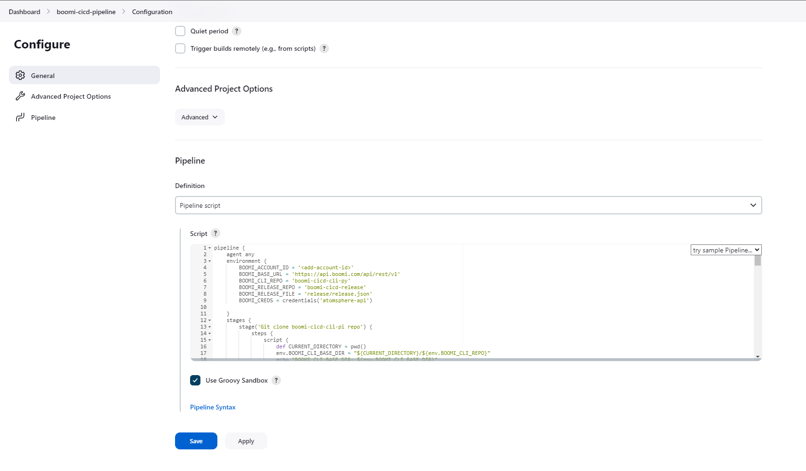
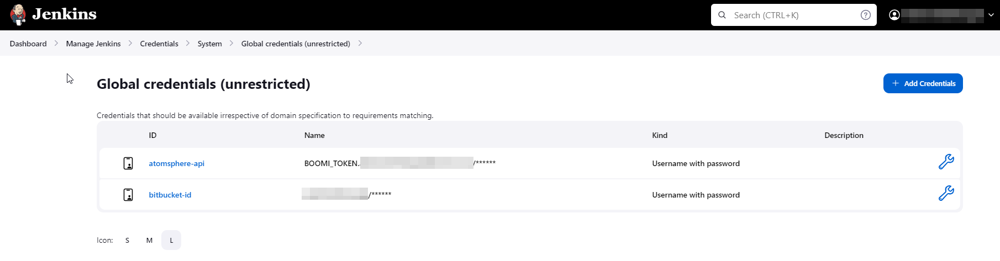

Jenkins Pipelnes
=================

1 Jenkins Pipeline Setup
------------------------

The Jenkins Pipeline is configured to promote Boomi packaged components from Development, to Stage, and to Production with a manual approval step before Stage and before Production.

1.1 Pre-requisites
------------------

* Jenkins 2.x.x (tested with 2.401.2)
* Jenkins Pipeline Plugin (tested with 1223.v41b_0279c361a)
* Python 4.11
* Pip for Python 4.11 installed

1.2 Create new Jenkins Pipeline
-------------------------------

Within Jenkins, create a new pipeline by creating a new item and selecting "Pipeline" as the type. Do not include spaces within the name of the pipeline because the script does not handle spaces. This example uses 'boomi-cicd-pipeline' as the name of the pipeline.

   Figure 1. Jenkins New Item Icon

.. figure:: assets-jenkins/jenkins-new-pipeline.png
   :width: 80%
   :align: center

   Figure 2. Select Pipeline as the New Item

Provide a description for the pipeline. Then scroll down to Pipelines, select Defintion as Pipeline Script, and paste the `contents of the Jenkinsfile <https://bitbucket.org/officialboomi/boomi-cicd-cli-py/src/main/boomi_cicd/templates/jenkin/jenkinsPipeline.jenkinsfile>`_. into the Script section. The script is specific to an installation of Python 3.11. Please be aware that how the release_pipeline.py script is executed might be slightly different in your environment.

The following values within the Jenkinsfile must be updated to match your environment:

.. table:: Table 1. Jenkins Pipeline Variables
   :align: center
   :width: 100%

   +----------------------------------------------+-------------------------------------------------------------------+
   | Jenkinsfile Variable                         | Description                                                       |
   +==============================================+===================================================================+
   | BOOMI_ACCOUNT_ID                             | The account ID of the Boomi account that you want to deploy to.   |
   +----------------------------------------------+-------------------------------------------------------------------+
   | BOOMI_ENVIRONMENT                            | The name of the Boomi environment that you want to deploy to.     |
   +----------------------------------------------+-------------------------------------------------------------------+
   | credentials('atomsphere-api')                | The name of the Jenkins credential that contains the Boomi        |
   |                                              | AtomSphere API key.                                               |
   +----------------------------------------------+-------------------------------------------------------------------+
   | git url for the boomi-cicd-cli-py repository | The URL of the repository that contains the Boomi CICD CLI        |
   |                                              | Python library. It is recommended to clone the officialboomi      |
   |                                              | Bitbucket repository and use a repository that you control.       |
   +----------------------------------------------+-------------------------------------------------------------------+
   | Credentials for boomi-cicd-cli-py repository | The name of the Jenkins credentials id that contains the username |
   |                                              | and password for the repository that contains the Boomi CICD CLI  |
   |                                              | Python library. This is only required if the repository is        |
   |                                              | private.                                                          |
   +----------------------------------------------+-------------------------------------------------------------------+
   | git url for the boomi-release reposity       | The URL of the repository that contains the Boomi Release JSON    |
   |                                              | file.                                                             |
   +----------------------------------------------+-------------------------------------------------------------------+
   | Credentials for boomi-release repository     | The name of the Jenkins credentials id that contains the username |
   |                                              | and password for the repository that contains the Boomi CICD CLI  |
   |                                              | Python library. This is only required if the repository is        |
   |                                              | private.                                                          |
   +----------------------------------------------+-------------------------------------------------------------------+

Update the BOOMI_ACCOUNT_ID at top environment variables section of the Jenkinsfile with your account ID. Then update BOOMI_ENVIRONMENT_NAME within the stages that are used to deploy. This pipeline is an example pipeline. You can modify the pipeline to meet your needs. Once complete, click Save.

.. figure:: assets-jenkins/jenkins-general-description.png
   :width: 80%
   :align: center

   Figure 3. Set the Pipeline Description

   Figure 4. Set the Pipeline Definition

Jenkin's Pipeline Script located within the template directory of the Boomi CICD CLI Python library.

.. literalinclude:: ../../boomi_cicd/templates/jenkins/jenkinsPipeline.jenkinsfile
   :linenos:

1.3 Create Jenkins Credentials
------------------------------

Next create the Jenkins credentials that are used by the pipeline. A set of credentisl are required for the Atomsphere API and another set of credentials are required for the git repositories that contains the Boomi CICD CLI Python library and the release json. If the git repository is public, then the credentials are not required.

To navigate to the Jenkins credentials, click on the user name in the top right, and then click on Credentials in the left panel. Create a new set of credentials by click on Sysmte and then Global credentials (unrestricted). Then click Add Credentials.

.. table:: Table 2. Jenkins Credentials
   :align: center

   +----------------------------------------------+-------------------------------------------------------------------+
   | Field                                        | Value                                                             |
   +==============================================+===================================================================+
   | Kind                                         | Username with password                                            |
   +----------------------------------------------+-------------------------------------------------------------------+
   | Scope                                        | Global                                                            |
   +----------------------------------------------+-------------------------------------------------------------------+
   | Username                                     | BOOMI_TOKEN.<boomi-username>                                      |
   +----------------------------------------------+-------------------------------------------------------------------+
   | Password                                     | Boomi AtomSphere API Key                                          |
   +----------------------------------------------+-------------------------------------------------------------------+
   | ID                                           | atomsphere-api                                                    |
   +----------------------------------------------+-------------------------------------------------------------------+
   | Description                                  | Username and password of Boomi Service Account.                   |
   +----------------------------------------------+-------------------------------------------------------------------+

.. figure:: assets-jenkins/jenkins-new-credentials.png
   :width: 80%
   :align: center

   Figure 5. Create new Jenkins Credentials for Atomsphere API.

   Figure 6. Jenkins Credentials for Atomsphere API and a single git repository.

1.4 Run the Jenkins Pipeline
----------------------------

Once complete, navigate back to the boomi-cicd-pipelilne and click on Build now. The pipeline will start and initially deploy to the Boomi Development environment. The pipeline has approval steps that require manual intervention before deploying to Stage and before Production.

.. figure:: assets-jenkins/jenkins-build.png
   :width: 80%
   :align: center

   Figure 7. Build the Jenkins Pipeline.

